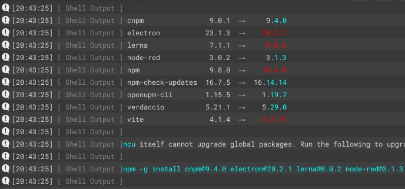
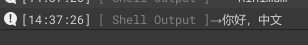
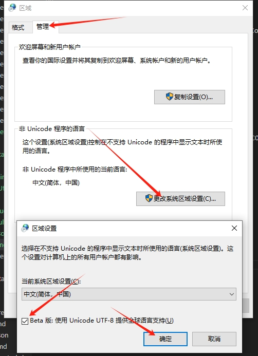
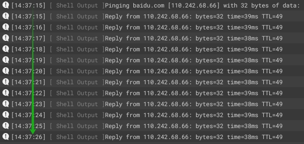
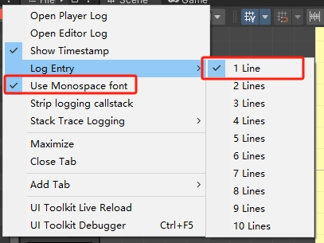

[](https://openupm.com/packages/com.bbbirder.shell/)

简单易用且功能丰富 Unity 命令行模块，用于 Editor 下调用命令行。


## Features List

重定向标准输出流到 Unity 控制台，支持众多特性。

### Multi-threaded

不显示窗口，不干扰开发者；异步执行，不用担心阻塞 Unity 线程。

### Waitable

可等待调用结果。

### Color Log

支持从标准输出流中识别彩色 log，并无缝对接到 UnityConsole。如下是执行`ncu --color -g`的输出结果：



### Encoding

Windows下，支持特殊字符、中文、英文等，不再受乱码困扰。



> 需要在 PlayerSetting 中指定宏：DETECT_STDOUT_ENCODING（不推荐），则会实时猜测输出流编码。或修改系统设置（推荐）。如下图：
>
> 
> 
> 使用编码猜测的方式并不完全可靠，可能遇到奇怪的问题，因此默认关闭。

### Immediate Log One By One

多步打印实时转发，可视化执行过程




## Install

Add git url `https://github.com/labbbirder/com.bbbirder.shell.git` to package manager

or

Execute shell in project root:

```bash
openupm add com.bbbirder.shell
```

## Basic Usage

Run a shell:

```csharp
using com.bbbirder.unityeditor;

Shell.RunCommand("python -V");
```

等待结果：

```csharp
async void Foo()
{
    var result = await Shell.RunCommand("python -V");
    Debug.Log(result.Output);   // output: 3.11.2
    Debug.Log(result.ExitCode); // output: 0
}
```

判断命令行工具是否存在:

```csharp
var hasTsNodeCli = Shell.ExistsCommand("ts-node");
```

设置环境变量，如果是`PATH`则为追加赋值:

```csharp
var hasTsNodeCli = Shell.ExistsCommand(
    "game-server",
    "path-to-server-dir",
    new Dictionary()
    {
        {"PATH", "D:/bin;"},       // env PATH += additional pathes
        {"RUNTIME_MODE", "DEBUG"}, // env RUNTIME_MODE := DEBUG
        {"PORT", "35311"},         // env PORT := 35311
    }
);
```

设置默认报错行为。如果命令行异常退出，默认不会报错。如果要改变默认行为：

```csharp
await Shell.ExistsCommand("ls Non-Exist-Path"); // error output only
Shell.ThrowOnNonZeroExitCode = true;
await Shell.ExistsCommand("ls Non-Exist-Path"); // throws

```

## Unity控制台设置

如果需要美化打印，可设置UnityConsole如下：


